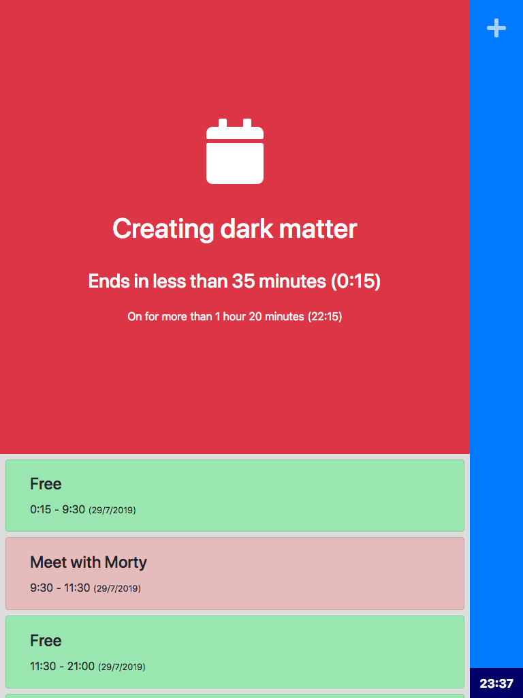

# Privashare

Privashare is a NodeJS web service that allows to display the status of a room ruled by a Google calendar.

As an example, it can be used in a wall-mounted screen outside of a meeting room, in order to show the current status of the availability of the meeting room.

## Installation

TODO